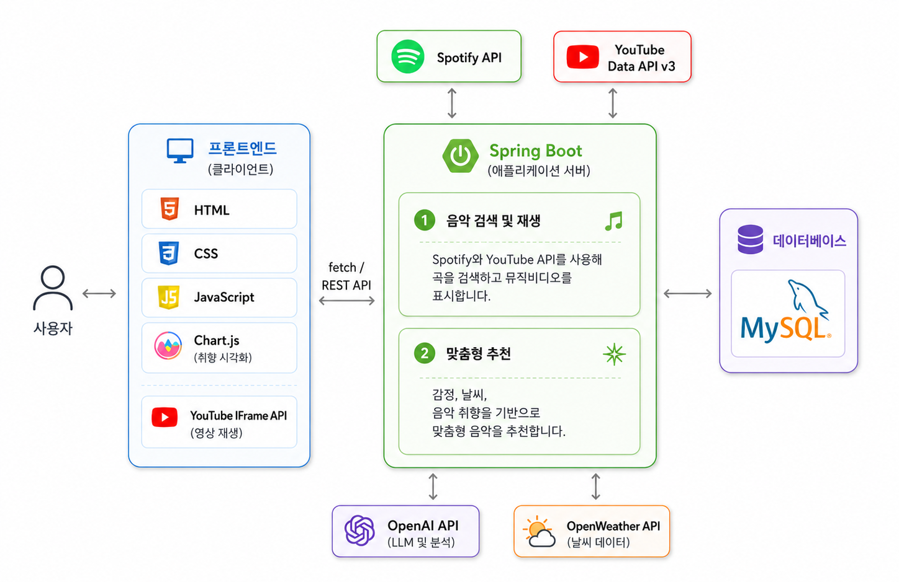

# MOOD WAVE

음악 스트리밍 개인화 추천 웹 서비스

---

## Introduction

MOOD WAVE는 음악 검색 / 재생뿐 아니라  
AI 감정 분석, 날씨 기반 추천, 음악 취향 분석 기능을 제공하는 웹 서비스입니다.

---

## Team

<table>
  <tr>
    <td align="center" width="180px">
      <a href="https://github.com/haejunbag131-maker">
        
         
        <b>박해준</b>
      </a>
       
      <b>Frontend</b>
    </td>
    <td align="center" width="180px">
      <a href="https://github.com/donghyeon01">
        
         
        <b>송동현</b>
      </a>
       
      <b>Frontend</b>
    </td>
    <td align="center" width="180px">
      <a href="https://github.com/Ppakso">
        
         
        <b>박소연</b>
      </a>
       
      <b>Frontend</b>
    </td>
    <td align="center" width="180px">
      <a href="https://github.com/cece-297">
        
         
        <b>이수아</b>
      </a>
       
      <b>Frontend</b>
    </td>
  </tr>
</table>

---

## Tech Stack

<table>
  <tr>
    <th width="120px">Frontend</th>
    <td>
      
      
      
    </td>
  </tr>
  <tr>
    <th width="120px">Backend</th>
    <td>
      
    </td>
  </tr>
  <tr>
    <th width="120px">Database</th>
    <td>
      
    </td>
  </tr>
  <tr>
    <th width="120px">API</th>
    <td>
      
      
      
      
      
    </td>
  </tr>
  <tr>
    <th width="120px">Library</th>
    <td>
      
    </td>
  </tr>
</table>

---

## Architecture

  

